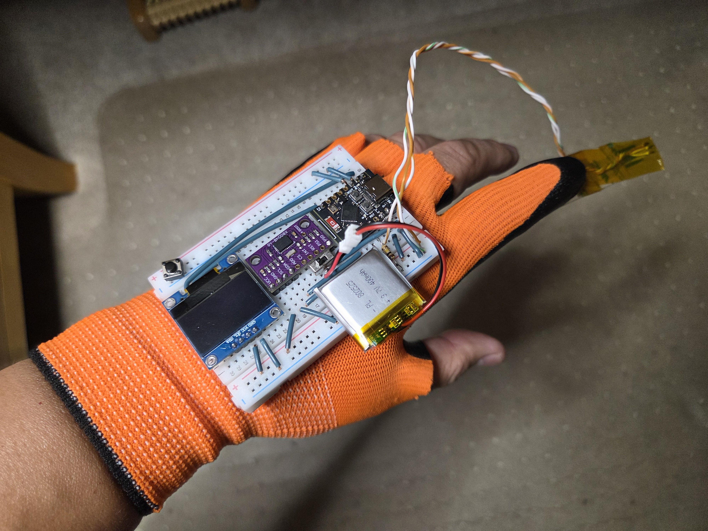
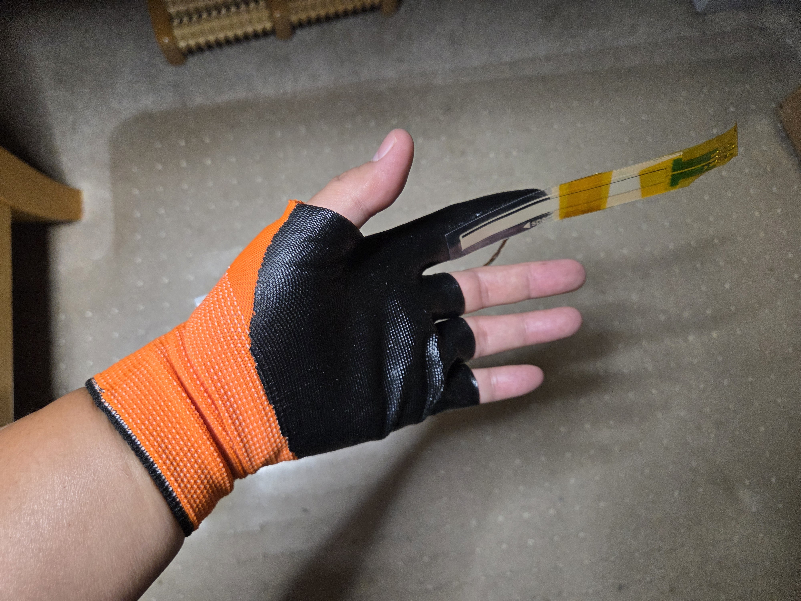
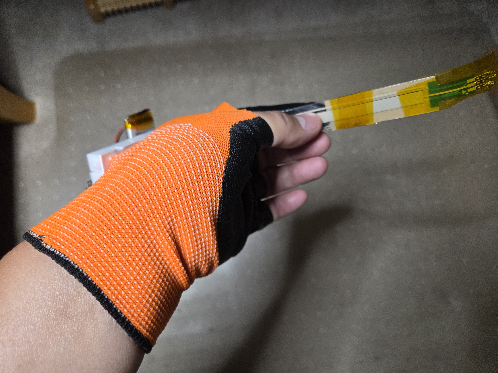
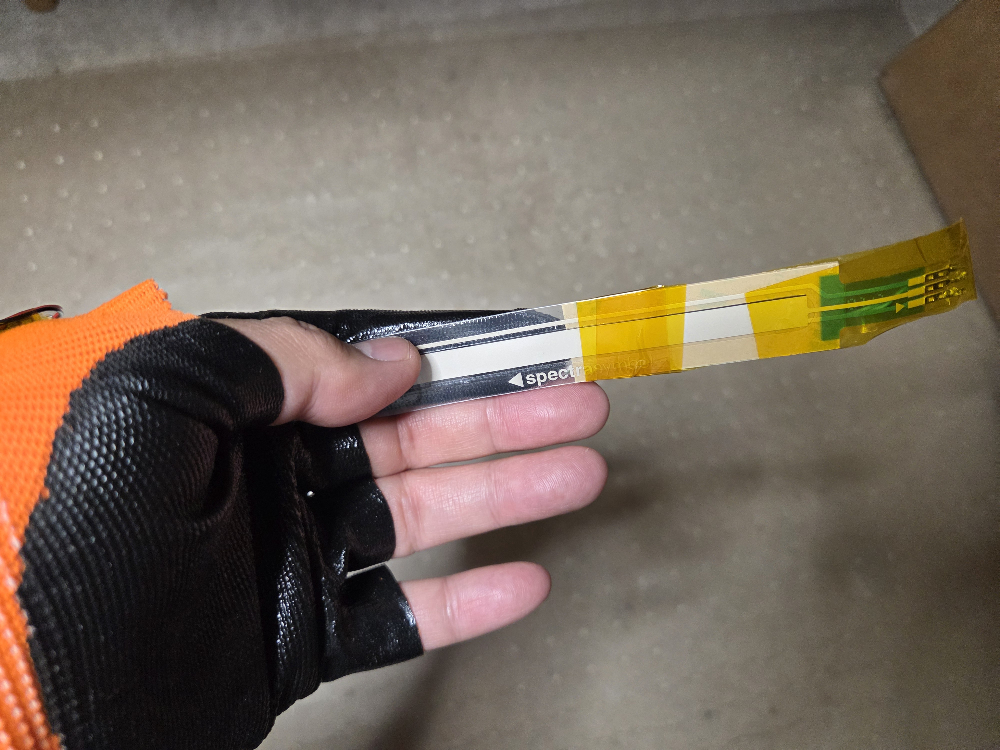
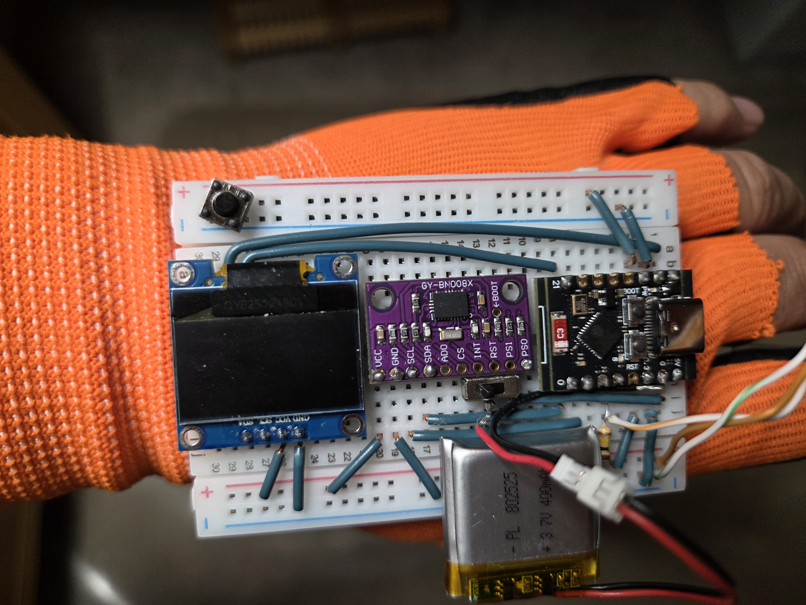
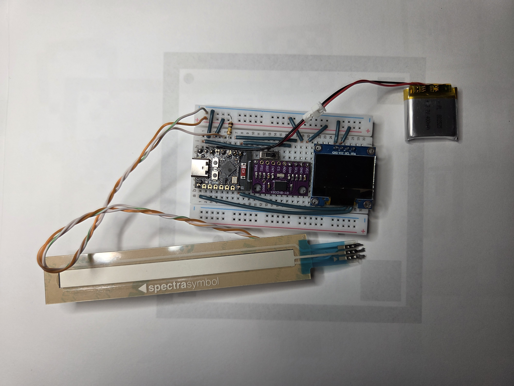

# esp32tracker

A prototype that streams hardware sensor input to an **Apple Vision Pro** app in real time. Three
devices: **left hand** and **right hand** glove trackers (orientation + touch), and an optional
**foot pedal** — together they drive a catheter/wire manipulation simulation.

```
┌──────────────────────┐   BLE notify ~50 Hz     ┌───────────────────────────┐
│ ESP32-C3 + BNO085 ×2 │ ──────────────────────► │   visionOS app            │
│ Left + Right hand    │   32-byte packet each   │   SwiftUI + RealityKit    │
│ (quat + touch + btn) │ ◄────────────────────── │   catheter/wire sim +     │
├──────────────────────┤   X-ray state write-    │   diagnostic cubes        │
│ ESP32-C3 foot pedal  │   back (all 3 boards    │   (owns the shared        │
│ (X-ray toggle only)  │   stay in sync)         │   X-ray state)            │
└──────────────────────┘                         └───────────────────────────┘
```

Each IMU does the sensor fusion onboard and sends a drift-corrected quaternion; the app renders it.
All boards share the same BLE service/characteristic UUIDs and are told apart by their advertised
name (`Left Hand Tracker` / `Right Hand Tracker` / `Foot Pedal`). X-ray works event-style: each
board flips a bit on a button/pedal press, the app owns the single shared on/off state and **writes
it back** to every board, so the hand OLEDs and the pedal LED always agree.

> **Orientation only** — position tracking is out of scope. An IMU alone cannot recover position
> (double-integrating acceleration drifts to meters within seconds), so these trackers report how each
> hand is *rotated*, not *where it is*. For hand position on Vision Pro, use ARKit hand tracking. See
> [SPEC.md](SPEC.md).

## Demo



*Wearable prototype: the whole tracker rides on the back of a glove — ESP32-C3 SuperMini + BNO08x IMU +
0.96" OLED + 3.7 V LiPo on a mini breadboard, with the SoftPot touch strip taped along the index finger
(slide a fingertip on it to grab/twist the catheter or wire in the Vision Pro app).*

- ▶ [**ESP32 tracker demo**](ESP32_tracker.mp4) — the glove tracker driving the system.
- ▶ [Hardware demo](20260621_012025.mp4) — the earlier breadboard tracker running.
- ▶ [Dashboard screen recording](Screen_Recording_20260621_011050_Chrome.mp4) — the browser dashboard (live cubes + SoftPot slide).

### More photos

| | | |
|---|---|---|
|  |  |  |
|  |  |  |



*The first (pre-glove) breadboard prototype.*

*(GitHub shows the photos inline and opens the `.mp4` files in its video player when clicked.)*

## Repository layout

| Path | What it is |
|------|-----------|
| [`SPEC.md`](SPEC.md) | Architecture, BLE protocol, packet format, build milestones |
| [`FRAME_MAPPING.md`](FRAME_MAPPING.md) | How sensor axes map to RealityKit, and how to calibrate it |
| [`project.yml`](project.yml) | XcodeGen config — generates the visionOS Xcode project |
| [`ESP32Tracker/`](ESP32Tracker/) | The visionOS app (SwiftUI + RealityKit + Core Bluetooth + ARKit hand tracking) |
| [`firmware/left/`](firmware/left/), [`firmware/right/`](firmware/right/) | Hand tracker sketches (BNO085 + OLED + SoftPot + X-ray button) |
| [`firmware/foot/`](firmware/foot/) | Foot pedal sketch (X-ray toggle only — no IMU/display) |
| [`pc_dashboard/`](pc_dashboard/) | Python + browser dashboard for testing the trackers without the headset |

## Hardware

Two identical trackers (one per hand), each mounted on the back of a glove:

- **ESP32-C3 SuperMini** — chosen because it has **BLE** (the WiFi-only D1 Mini can't talk to Vision Pro).
- **BNO085** IMU over I2C (SDA = GPIO0, SCL = GPIO1) — fused, drift-corrected orientation. (A
  BNO055 / DFRobot SEN0253 also works with a library swap.)
- **SoftPot touch strip** along the index finger (wiper on GPIO3) — reports the touch **start** point and
  **current** point; the app uses touch = grab and slide = twist.
- **X-ray toggle button** (GPIO6/7) — flips a bit in the packet; either hand's button toggles the app's
  shared X-ray view. The app writes the shared state back (characteristic `…0003`), and the OLED shows
  that synced state.
- **0.96" OLED** status display (software I2C on GPIO5/21) — BOOT button toggles it, auto-offs after 10 s.
  Refreshes every 0.5 s with cheap single-row writes (labels draw once), so it never stalls the BLE loop.
- **3.7 V LiPo** for untethered use.

Plus an optional third board — the **foot pedal** ([`firmware/foot/foot.ino`](firmware/foot/foot.ino)):
an ESP32-C3 with a momentary pedal switch on GPIO6/7 that toggles the same shared X-ray state. No IMU or
display; its onboard LED blinks while advertising and mirrors the X-ray state once connected.

The left/right sketches differ by one `#define IS_LEFT_HAND` line (which picks the BLE name). Wiring
and flashing steps are in [`firmware/README.md`](firmware/README.md).

## Quick start

### 1. Firmware
```
cd firmware
pio run -t upload      # then: pio device monitor
```
Confirm the serial log shows `BNO08x ready` and `BLE advertising as Left Hand Tracker` (or
`Right Hand Tracker`). Flash both hand boards (`firmware/left/`, `firmware/right/`) and, if you use
one, the pedal (`firmware/foot/`). Verify the BLE data with a phone scanner (nRF Connect) **before**
touching the app — see [`firmware/README.md`](firmware/README.md).

### 2. visionOS app
```
brew install xcodegen   # once
xcodegen generate
open ESP32Tracker.xcodeproj
```
Set your signing team, build to a **real Vision Pro** (Bluetooth and hand tracking don't work in the
Simulator). The app connects to the trackers automatically and opens straight into the simulation:
touch the SoftPot to **grab** the catheter (left) or wire (right), slide on the strip or roll the
tracker to **twist** it, move your hand along X to **advance/retract** it, and press any X-ray
button/pedal to toggle the see-through view. Details and the manual-Xcode alternative:
[`ESP32Tracker/README_SETUP.md`](ESP32Tracker/README_SETUP.md).

### 3. Make it line up
The objects will rotate on the "wrong" axes until you calibrate the coordinate-frame mapping. Follow
the 10-minute procedure in [`FRAME_MAPPING.md`](FRAME_MAPPING.md), then use the app's **Re-center**
buttons (per hand, or "Re-center both").

## Status

Working prototype. Milestones reached (see [`SPEC.md`](SPEC.md)): connect → display raw data → rotate
objects → SoftPot touch events + X-ray button → **catheter/wire simulation** (the app opens an immersive
space where the SoftPot grabs, strip-slide + tracker roll twists, and Vision Pro hand tracking
advances/retracts a catheter and guidewire — the same interaction model as the VascCath trainer) →
**foot pedal** as a third X-ray input → **X-ray state write-back** keeping all three boards' displays
in sync. IMU-based position tracking remains out of scope.

## Notes

- `project.yml` is the source of truth for the Xcode project; the generated `.xcodeproj` is a build
  artifact and is git-ignored. Edit the yml and re-run `xcodegen generate` rather than changing
  project settings in Xcode's UI.
- BLE UUIDs and the 32-byte packet layout are defined once in [`SPEC.md`](SPEC.md) and must match in
  the firmware (`firmware/left/left.ino`, `firmware/right/right.ino`, `firmware/foot/foot.ino`) and the
  app (`ESP32Tracker/TrackerState.swift` for packet parsing, `ESP32Tracker/BLEManager.swift` for UUIDs).
  Characteristic `…0002` streams the packet board→app; `…0003` carries the shared X-ray state app→board.
