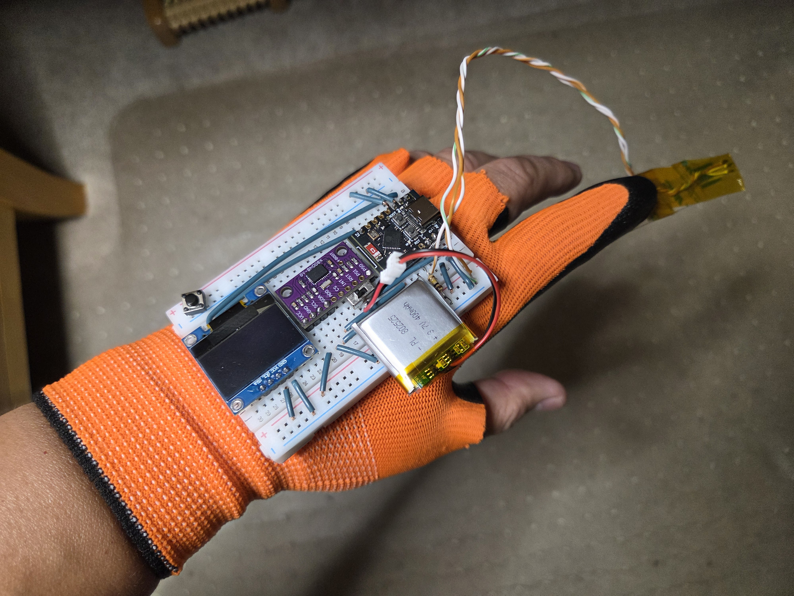
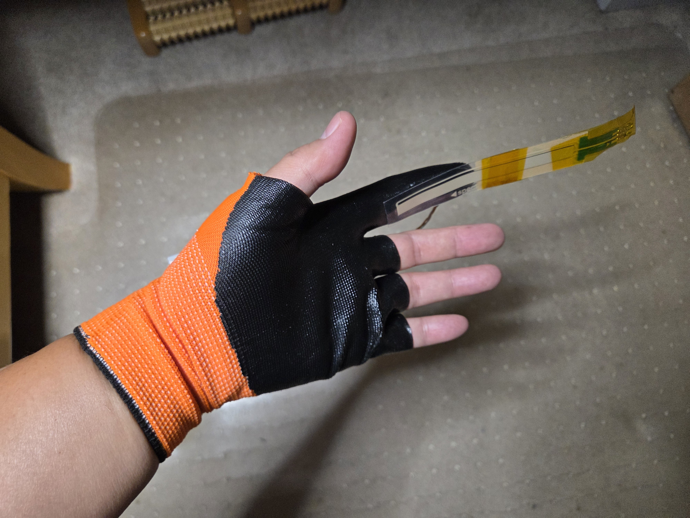
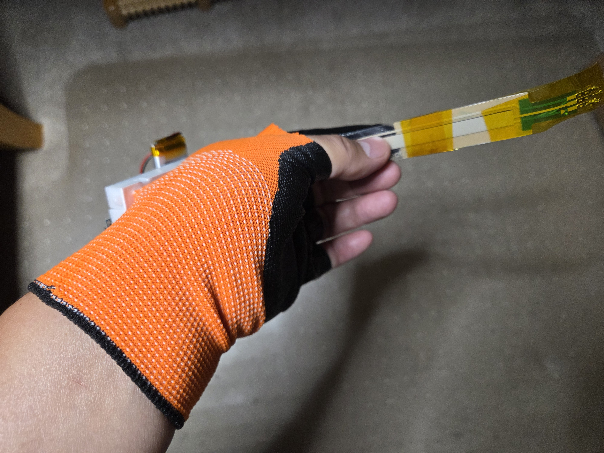
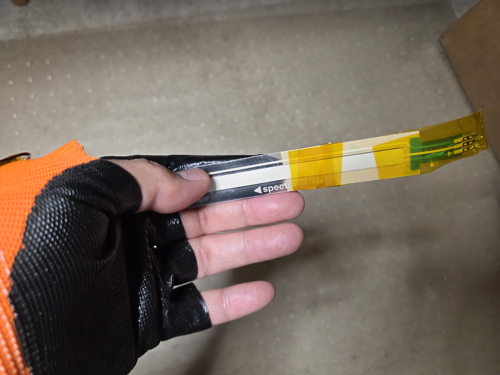
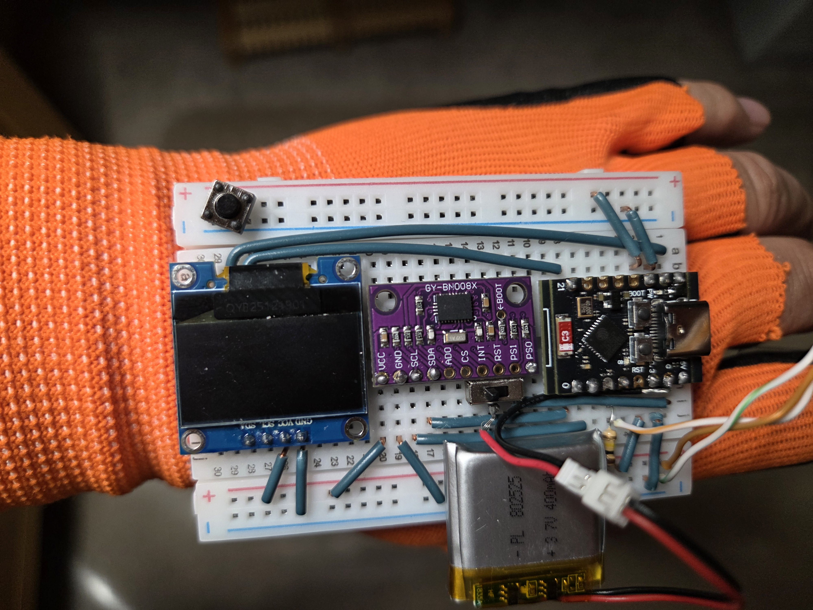
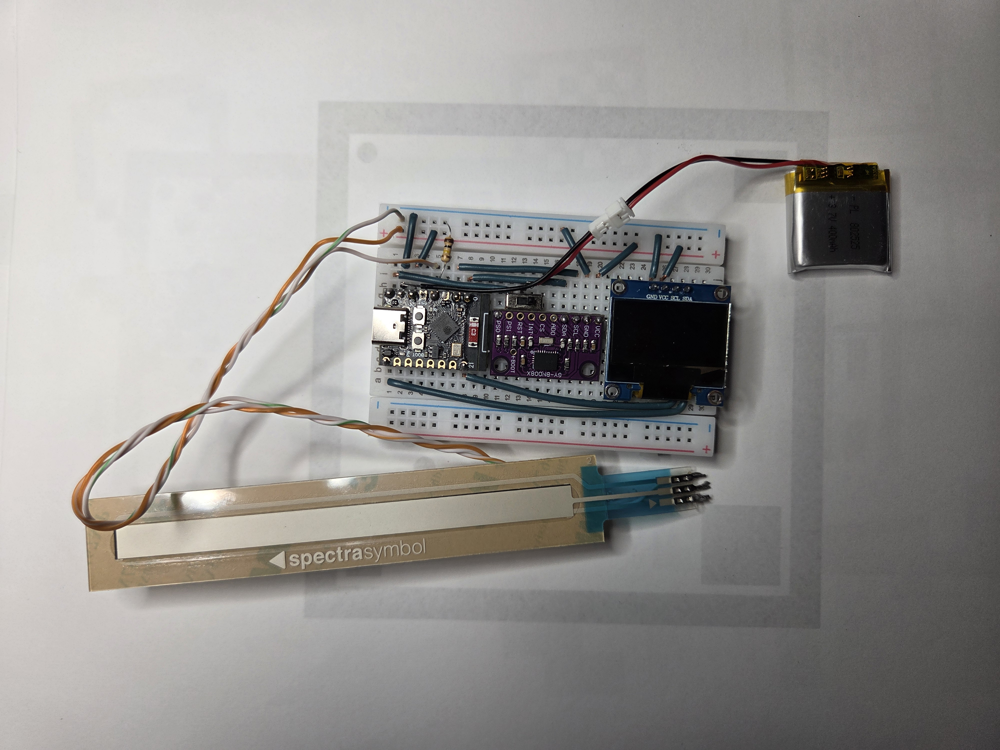

# esp32tracker

A catheter/guidewire training prototype for **Apple Vision Pro**. Hand-worn ESP32 trackers drive the
tools; ESP32 foot pedals drive the imaging controls a real fluoro suite puts on the floor.

```
┌────────────────────────────┐                          ┌──────────────────────────┐
│ HANDS   ESP32-C3 ×2        │ ── CONNECTION ─────────► │ visionOS app             │
│ IMU + SoftPot, one/glove   │    notify ~50 Hz,        │ SwiftUI + RealityKit     │
│                            │    32-byte packet        │                          │
├────────────────────────────┤                          │ PC dashboard             │
│ PEDALS  ESP32-S3 ×3        │ ── BROADCAST ──────────► │ (same protocol, no       │
│ fluoro · capture · DSA      │    advertising mfg data │  headset needed)         │
└────────────────────────────┘                          └──────────────────────────┘
```

**Two transports, deliberately.** Vision Pro has a small BLE connection budget — with both hands
connected, a third connection fails with `CBError 11 "connection limit reached"`. So only the hands
connect (they stream continuous orientation and need to). The pedals never connect: each advertises
its state in manufacturer data, and consumers read it straight out of a continuous scan. That also
means any number of pedals can be added without spending a connection slot.

Each IMU does the sensor fusion onboard and sends a drift-corrected quaternion; the app stays simple
and just renders it. All boards share one BLE service UUID and are told apart by advertised name.

> **Orientation only** — position tracking is out of scope. An IMU alone cannot recover position
> (double-integrating acceleration drifts to meters within seconds), so these trackers report how each
> hand is *rotated*, not *where it is*. For hand position on Vision Pro, use ARKit hand tracking. See
> [SPEC.md](SPEC.md).

## Demo



*Wearable prototype: the whole tracker rides on the back of a glove — ESP32-C3 SuperMini + BNO08x IMU +
0.96" OLED + 3.7 V LiPo on a mini breadboard, with the SoftPot touch strip taped along the index finger
(slide a fingertip on it to grab/twist the catheter or wire in the Vision Pro app).*

- ▶ [**ESP32 tracker demo**](ESP32_tracker.mp4) — the glove tracker driving the system.
- ▶ [Hardware demo](20260621_012025.mp4) — the earlier breadboard tracker running.
- ▶ [Dashboard screen recording](Screen_Recording_20260621_011050_Chrome.mp4) — the browser dashboard (live cubes + SoftPot slide).

### More photos

| | | |
|---|---|---|
|  |  |  |
|  |  |  |



*The first (pre-glove) breadboard prototype.*

*(GitHub shows the photos inline and opens the `.mp4` files in its video player when clicked.)*

## Repository layout

| Path | What it is |
|------|-----------|
| [`SPEC.md`](SPEC.md) | Architecture, BLE protocol, packet format, build milestones |
| [`FRAME_MAPPING.md`](FRAME_MAPPING.md) | How sensor axes map to RealityKit, and how to calibrate it |
| [`project.yml`](project.yml) | XcodeGen config — generates the visionOS Xcode project |
| [`ESP32Tracker/`](ESP32Tracker/) | The visionOS app (SwiftUI + RealityKit + Core Bluetooth) |
| [`firmware/`](firmware/) | One Arduino sketch folder per board — see the table below |
| [`pc_dashboard/`](pc_dashboard/) | Browser dashboard: drive and verify every board, and the whole simulation model, without the headset |

### Boards

Each board gets its own sketch folder (Arduino requires the folder name to match the `.ino`).
Paired sketches are byte-identical apart from one `#define`, so **regenerate rather than hand-edit
both**.

| Board | Sketch | BLE name | Role |
|---|---|---|---|
| Hand tracker ×2 | [`left/`](firmware/left/) · [`right/`](firmware/right/) | `Left/Right Hand Tracker` | IMU orientation + SoftPot (connected) |
| Mini tracker ×2 | [`left-mini/`](firmware/left-mini/) · [`right-mini/`](firmware/right-mini/) | `Left/Right Mini Tracker` | MPU-6050 + SoftPot + 2 buttons + onboard OLED (connected) |
| Fluoro pedal | [`left-foot/`](firmware/left-foot/) | `Left Foot Pedal` | **hold** = X-ray on (broadcast) |
| Capture pedal | [`right-foot/`](firmware/right-foot/) | `Right Foot Pedal` | press = one X-ray capture (broadcast) |
| DSA pedal | [`dsa-foot/`](firmware/dsa-foot/) | `DSA Foot Pedal` | **hold** = contrast run (broadcast) |

A Mini tracker is a drop-in alternative for a hand slot — the dashboard and app accept either name
for the same hand, over the identical 32-byte packet.

## Hardware

Two identical trackers (one per hand), each mounted on the back of a glove:

- **ESP32-C3 SuperMini** — chosen because it has **BLE** (the WiFi-only D1 Mini can't talk to Vision Pro).
- **BNO085** IMU over I2C (SDA = GPIO0, SCL = GPIO1) — fused, drift-corrected orientation. (A
  BNO055 / DFRobot SEN0253 also works with a library swap.)
- **SoftPot touch strip** along the index finger (wiper on GPIO3) — reports the touch **start** point and
  **current** point; the app uses touch = grab and slide = twist.
- **X-ray toggle button** (GPIO6/7) — flips a bit in the packet; either hand's button toggles the app's
  shared X-ray view.
- **0.96" OLED** status display (software I2C on GPIO5/21) — wakes on the BOOT button, auto-offs after 10 s.
- **3.7 V LiPo** for untethered use.

The left/right sketches differ by one `#define IS_LEFT_HAND` line (which picks the BLE name). Wiring
and flashing steps are in [`firmware/README.md`](firmware/README.md).

### Mini trackers (ESP32-C3 with 0.42" OLED)

A cheaper glove unit: an **MPU-6050** in place of the BNO085, plus the SoftPot and both buttons,
with status on the board's own 72×40 OLED.

| Function | Pins | Notes |
|---|---|---|
| MPU-6050 | GPIO5 SDA / GPIO6 SCL | **shares the OLED's I2C bus** (OLED `0x3C`, IMU `0x68`) — costs no pins. **VCC → 3V3, never 5V** |
| SoftPot wiper | GPIO0 | ADC; internal pulldown enabled, so no external resistor |
| X-ray button | GPIO8 (sense) ↔ GPIO7 (gnd) | GPIO8 is strapping, so it **must** be the pull-up sense pin |
| Capture button | GPIO3 ↔ GPIO4 | |
| Onboard OLED | GPIO5 / GPIO6 | hardware I2C, already wired on the board |

The GY-521's pull-ups tie SDA/SCL to VCC, so powering it from 5 V would put 5 V on the C3's
3.3 V-only GPIOs — use 3V3. Leave AD0, INT, XDA and XCL unconnected (XDA/XCL are the MPU's
*auxiliary master* port for attaching a magnetometer, not a second host interface).

**The MPU-6050 does no fusion of its own**, unlike the BNO085 — so the sketch integrates the gyro
to produce the quaternion. Rotation tracks well moment-to-moment, but with no magnetometer there is
no absolute reference and orientation drifts on all three axes. Two things keep it usable: a
gyro-bias calibration at boot (**hold the board still for ~1.5 s after power-up**) and a deadband
that stops a still board creeping — in simulation, 60 s of typical residual bias drifts 46° without
the deadband and 0° with it. Expect slow drift over minutes regardless, worse as the board warms,
and re-center in the app. `USE_ACCEL_TILT` in the sketch turns on gravity correction for roll/pitch
if that isn't good enough; yaw needs a magnetometer.

C3 pin constraints that shaped this: ADC exists only on GPIO0–4, GPIO2 is strapping (a floating
SoftPot wiper there can stop the boot), GPIO9 is the BOOT button. **The SoftPot's centre pin is the
wiper — the outer two are the strip ends and take 3V3/GND.** Powering it across the wiper shorts when
the strip is pressed near the far end; that burned a wire once.

### Foot pedals (ESP32-S3 SuperMini, one per pedal)

Hands-free controls for the things a real fluoro suite puts on the floor. Vision Pro runs out of
BLE connection slots with both hands connected (`CBError 11`), so pedals **never connect** — each
one broadcasts its state in advertising manufacturer data and consumers read it from a continuous
scan. Details in [`pc_dashboard/README.md`](pc_dashboard/README.md).

| Pedal | Sketch | Wiring | Behaviour |
|---|---|---|---|
| **Fluoro** (X-ray) | [`firmware/left-foot/`](firmware/left-foot/) | button across GPIO12↔11 | **hold** = X-ray on (dead-man switch) |
| **Capture** | [`firmware/right-foot/`](firmware/right-foot/) | button across GPIO9↔8 | press = one X-ray screen capture |
| **DSA** (contrast run) | [`firmware/dsa-foot/`](firmware/dsa-foot/) | SPDT: COM→GPIO12, NO→GPIO10, NC→GPIO8 | **hold** = contrast run (implies X-ray) |

The DSA pedal's 3-wire SPDT hookup reads both contacts, so its firmware also detects an unplugged
or miswired switch and reports a fault instead of silently never firing. Both *hold* pedals fail
safe: a few seconds of radio silence ends the run / turns X-ray off rather than latching it on.

## Quick start

### 1. Firmware

Open the board's own sketch folder and upload it (Arduino IDE, or `arduino-cli upload -p PORT
--fqbn ... firmware/<folder>`). Toolchain is pinned: **ESP32 core 2.0.17** (3.x crashes with
NimBLE) and **NimBLE-Arduino 1.4.x** (not 2.x), USB CDC On Boot enabled, 115200 baud.

> **Flash the sketch you think you're flashing.** Arduino uploads the *focused editor tab*, not the
> file you last opened — swapping the USB cable without switching tabs silently flashes the same
> sketch twice. This has bitten this project more than once (two boards both announcing themselves
> as `RIGHT`). Always confirm from the serial banner, which names the board it's running:
> `Device: Left Foot Pedal — LEFT FOOT (X-ray while held)`.

Then verify before touching the app: the [PC dashboard](pc_dashboard/) sees every board over the
same protocol the headset uses, and prints each pedal's raw broadcast payload as it appears. A phone
scanner (nRF Connect) also works.

### 2. visionOS app
```
brew install xcodegen   # once
xcodegen generate
open ESP32Tracker.xcodeproj
```
Set your signing team, build to a **real Vision Pro** (Bluetooth doesn't work in the Simulator), tap
**Scan**. Details and the manual-Xcode alternative: [`ESP32Tracker/README_SETUP.md`](ESP32Tracker/README_SETUP.md).

### 3. Make it line up
The objects will rotate on the "wrong" axes until you calibrate the coordinate-frame mapping. Follow
the 10-minute procedure in [`FRAME_MAPPING.md`](FRAME_MAPPING.md), then use the app's **Re-center**
buttons (per hand, or "Re-center both").

## Status

Working prototype. Milestones reached (see [`SPEC.md`](SPEC.md)): connect → display raw data → rotate
objects → SoftPot touch events + X-ray button → **catheter/wire simulation** (the app opens an immersive
space where the SoftPot grabs, strip-slide + tracker roll twists, and Vision Pro hand tracking
advances/retracts a catheter and guidewire — the same interaction model as the VascCath trainer) →
**foot pedals** for fluoro, capture and DSA contrast runs. IMU-based position tracking remains out of
scope.

Imaging state is *derived*, not stored: `latched (hand buttons toggle) OR fluoro-pedal-held OR
dsa-active`. Releasing a pedal returns to whatever the buttons had latched. Both the app and the
dashboard implement this identically — change one, change the other.

## Continuing on the Mac

Pull first — the Windows side pushes firmware and dashboard work, the Mac side pushes the app.

**Swift now compiles.** The Windows-written files were built for visionOS on the Mac and needed no
fixes: pedal levels (hold-to-activate), the `.dsaFoot` case, derived `xrayOn`, the two-stage silence
timeouts, the DSA run/fault readout, and the contrast-fill vessel all came up clean.

**Mini tracker support added on the Mac.** `Hand.from(advertisedName:)` now matches
`Left/Right Mini Tracker` as well, so a Mini fills a hand slot in the headset exactly as it does on
the dashboard, and `Hand.isMini` flags it. `TrackerState` reads a Mini's byte 28 as the
capture-toggle bit (baselining the first packet so connecting mid-press can't fire a phantom
capture) and reports calibration as 0, matching `tracker_dashboard.on_packet`.

**Capture now shoots a pair.** One press of the capture pedal (or a Mini's capture button) freezes
the sim state and renders **two** photos into `Documents/Captures/`, thumbnails of both showing in the
window:

1. **X-ray monitor** — the fluoro image: dark field, vessel across it, catheter and guidewire as
   radiopaque lines at their live depths, contrast-filled during a DSA run, with burned-in corner
   annotations (FLUORO/DSA, image number, depths).
2. **180° room view** — the wide shot of the suite: circular fisheye frame with table, patient, C-arm,
   ceiling monitor (lit when imaging) and the tools in hand.

> The room view renders the **simulated** suite, not the physical room. visionOS only exposes the
> passthrough cameras under Apple's *Enterprise* "Main Camera Access" entitlement
> (`com.apple.developer.arkit.main-camera-access.allow`), which this app doesn't hold — so no
> non-enterprise app can photograph the real room. Add the entitlement and `RoomView180` is the place
> to swap in a real frame.

**Known gaps on the app side:**

- `onDSARunStart` is a hook with no consumer — the natural home for recording/playing back a run.

**Tuning worth revisiting on device:** the pedal silence windows (`levelReleaseAfter` = 4 s,
`pedalOfflineAfter` = 5 s) were sized from *Windows* measurements, where the OS aggregates repeat
advertisements and delivers only ~1–3 ads/s. CoreBluetooth with `allowDuplicates` may deliver far
more densely; if the status dots and X-ray hold prove rock solid on the headset, these can be
tightened — which shortens how long a dead pedal takes to release X-ray.

## Notes

- `project.yml` is the source of truth for the Xcode project; the generated `.xcodeproj` is a build
  artifact and is git-ignored. Edit the yml and re-run `xcodegen generate` rather than changing
  project settings in Xcode's UI.
- BLE UUIDs and the 32-byte packet layout are defined once in [`SPEC.md`](SPEC.md) and must match in
  the firmware (`firmware/left/left.ino`, `firmware/right/right.ino`) and the app
  (`ESP32Tracker/TrackerState.swift` for packet parsing, `ESP32Tracker/BLEManager.swift` for UUIDs).
- **Pedals use a second, unrelated protocol**: advertising manufacturer data under company ID
  `0xFFFF`, laid out `[count, level(, flags)]` after the ID. `count` increments per press, `level` is
  a live 0/1 (the hold pedals' whole point), and the DSA pedal adds `flags` bit0 = switch wiring
  fault. Consumers index fixed positions and tolerate short payloads, so **old firmware degrades
  instead of breaking** — a pre-level board simply never reports "held". Both consumers parse this:
  `tracker_dashboard.on_pedal_ad` and `BLEManager.handlePedalAd`.
- **Don't size consumer timeouts from the firmware's advertising interval.** Measured: a pedal
  sending ~7–10 ads/s was delivered at ~1–3/s with gaps to ~3 s, because the host OS aggregates
  repeat advertisements. WinRT's `SignalStrengthFilter` sampling interval makes it *worse*, not
  better. Measure, don't assume.
- The Mini trackers repurpose the packet's `calib` byte as a capture-toggle bit. This applies to
  Mini boards only — a BNO085 tracker's `calib` legitimately changes 0–3. **Byte 28 is therefore
  not available for IMU status on a Mini**, even now that it has an MPU-6050; its gyro-calibration
  state is shown on the OLED and serial instead, which is why adding the IMU needed no protocol,
  dashboard or app changes at all.
